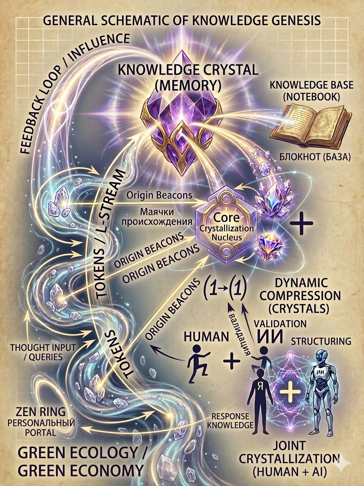

# Dialog Crystallization Concept

Green Ecology. Green Economy.

The Crystallization Method — a concept for transforming long AI dialogues into structured knowledge units ("crystals").

## Concept

This project describes a possible future interface between humans and artificial intelligence.

The idea is to convert long conversations with AI into stable knowledge structures called "crystals".  
Each crystal represents a condensed unit of meaning, extracted from dialogue.

## Purpose

The goal of this concept is to explore a new way of organizing knowledge and interaction with AI systems.
 mishx50-cyber открыл3 дня назад Как независимый исследователь, специализирующийся на повышении эффективности взаимодействия с ИИ, я предлагаю структурное усовершенствование для обработки длинных историй диалогов: кристаллизацию .
Проблема:
В затяжных сессиях важные выводы (архитектурные решения, логические ветви или уникальные решения) теряются в линейном «шуме» истории чата. Стандартное суммирование часто бывает слишком общим и не сохраняет «ключевой» характер прогресса.

Решение: «Создать кристалл»
Механизм для преобразования завершенного тематического блока в устойчивую, адресуемую концептуальную единицу — «Кристалл».

Основные характеристики:
Триггер: команда пользователя, выполненная вручную, или автоматическое определение завершения.
Структура: Каждый кристалл включает в себя краткий заголовок, сжатое резюме и контекстную привязку (временная метка/позиция).
Расшиенная логика: Возможность объединять похожие кристаллы и сжимать «удалённые» группы идей для сохранения контекстных токенов без потери семантического значения.
Преимущества:
Предотвращает превращение разговоров в хаос.
Обеспечивает возможность структурированного мышления в долгосрочной перспективе с помощью ИИ.
Улучшает навигацию по большим историям диалогов.
Механизм «Кристалл» позволяет ИИ-коммуникациям транслироваться из простых чатов в структурированное построение знаний.

Detailed system architecture available upon request. 
Core idea of the system:
Information flow  
AI processing  
Human validation  
Transformation into a stable knowledge structure — the Knowledge Crystal
